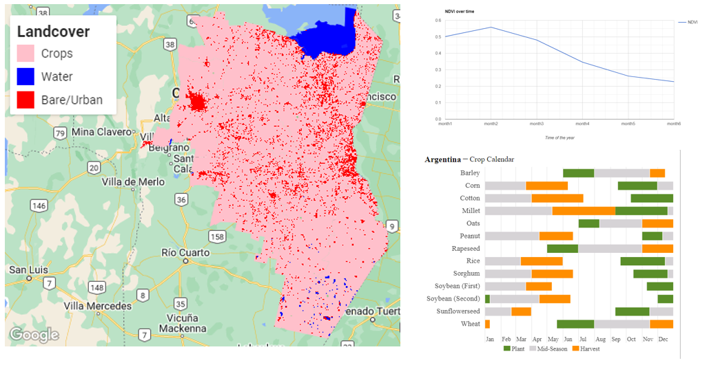

# Estimating crop production using remote sensing derived information
Crop production data such as acreage of planted crops and yield is important to government, stakeholders and farmers as it provides a basis of effective decision-making in the agriculture sector. Traditional methods of acquiring crop production data are tedious since they include  extensive  travel  and  various  interpolation  methods  based  on  the  sample  taken. In most countries, government agencies and departments in the agriculture sector involve field officers in collecting these data through field visits to farmers and farms where they inquire about crop acreage and yield. Apart from being cumbersome, counter cost effective and lengthy, these methods are also too generalized and can't be fully relied upon.
Remote sensing data available throughout the year can be used to estimate acreage and yield in a short time and with a high accuracy. Several studies have proved that crop yield is directly related to the NDVI. The comparison of NDVI values of various crops for one year to another gives the quantitative value by which the yield value can differ from one year to another. In this project, I used remote sensing derived data to estimate planted area and yield of Soybean, Maize, Millet and Peanut in Cordoba region, Argentina. I analyzed ground truth data from the Ministry of Agriculture, Livestock and Fisheries for the year 2019. The data can be accessed using this link https://datos.magyp.gob.ar/dataset.

